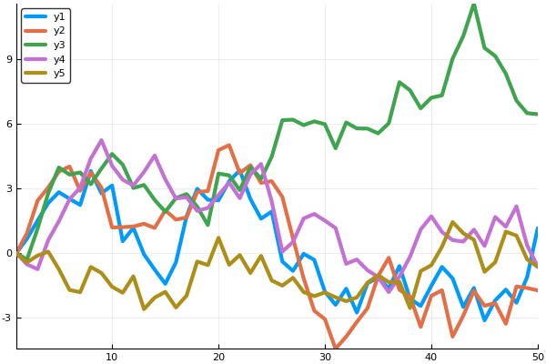
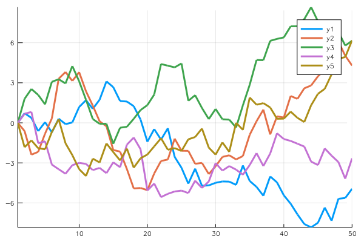

JuliaCall in R Markdown
================
Changcheng Li
2017-11-16

Use JuliaCall as Julia Engine in R Markdown
-------------------------------------------

To use `JuliaCall` package for julia engine in R Markdown document. Just set the engine for julia to `JuliaCall::eng_juliacall` like this:

``` r
knitr::opts_chunk$set(echo = TRUE)
knitr::knit_engines$set(julia = JuliaCall::eng_juliacall)
```

Below is how it looks like when using `JuliaCall` as language engine for Julia.

How Does JuliaCall in R Markdown Look Like?
-------------------------------------------

``` julia
## This is a julia language chunk.
## In julia, the command without ending semicolon will trigger the display
## so is JuliaCall package. 
## The julia display will follow immediately after the corresponding command
## just as the R code in R Markdown.
a = sqrt(2)
```

    ## 1.4142135623730951

``` julia
a = sqrt(2);

## And lots of different types of display are supported in JuliaCall.
## Like markdown and plots.
@doc sqrt
```

    ## ```
    ## sqrt(x)
    ## ```
    ## 
    ## Return $\sqrt{x}$. Throws [`DomainError`](@ref) for negative [`Real`](@ref) arguments. Use complex negative arguments instead. The prefix operator `√` is equivalent to `sqrt`.

### Support for `Plots.jl`

`Plots.jl` is an easy to use and powerful julia package for plotting, <https://github.com/JuliaPlots/Plots.jl>. And `JuliaCall` supports `Plots.jl` of cource!!

``` julia
using Plots
```

#### PyPlot backend

``` julia
pyplot()
```

    ## Plots.PyPlotBackend()

``` julia
plot(Plots.fakedata(50,5),w=3)
```



#### GR backend

``` julia
gr()
```

    ## Plots.GRBackend()

``` julia
plot(Plots.fakedata(50,5),w=3)
```



Get Access to Julia in R Chunk
------------------------------

And you can also get access to julia variables in R code chunk quite easily using `JuliaCall`, for example:

``` r
library(JuliaCall)
## This is a R language chunk.
## In the previous julia chunk, we define variable a, 
## we can use functions in JuliaCall to get access to it.
julia_eval("a")
```

    ## [1] 1.414214
