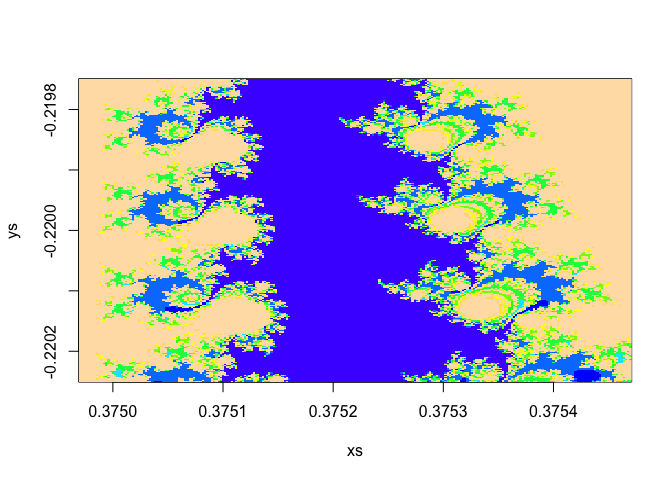

Improve R's Performance using JuliaCall with Mandel Set Example
===============================================================

What is Mandelbrot Set?
-----------------------

Mandelbrot set is the set of complex numbers *c* for which the sequence {0, *f*<sub>*c*</sub>(0),*f*<sub>*c*</sub>(*f*<sub>*c*</sub>(0)), …, *f*<sub>*c*</sub><sup>(*n*)</sup>(0),…} remains bounded in absolute value where function *f*<sub>*c*</sub>(*z*)=*z*<sup>2</sup> + *c*. For more detailed introduction, you could go to [Wikipedia page for Mandelbrot set](https://en.wikipedia.org/wiki/Mandelbrot_set).

The calculation for Mandelbrot set involves heavy computation, and here we will use JuliaCall to speed up the computation by rewriting R function in Julia, and we will also see some easy and useful tips in writing higher performance Julia code. In this example, we will see that JuliaCall actually brings **more than 100 times speedup** of the calculation.

Pure R Implementation
---------------------

The R implementation for the calculation of Mandelbrot set is quite straightforward. Note that it could be proved that if absolute value of one item in the sequence is greater than 2, the sequence {0, *f*<sub>*c*</sub>(0),*f*<sub>*c*</sub>(*f*<sub>*c*</sub>(0)), …, *f*<sub>*c*</sub><sup>(*n*)</sup>(0),…} will be divergent.

In the `mandelbrot` function, we keep the iteration number that the absolute value of the item is greater than 2 until the maximum iteration times.

And in the `mandelbrotImage` function, for two given sequences of *x* and *y*, we calculate the value of `mandelbrot` function divided by the maximum iteration times on every grid point.

``` r
mandelbrot <- function(c, iterate_max = 500){
    z <- 0i
    for (i in 1:iterate_max) {
        z <- z ^ 2 + c
        if (abs(z) > 2.0) {
            return(i)
        }
    }
    iterate_max
}

mandelbrotImage <- function(xs, ys, iterate_max = 500){
    sapply(ys, function(y) sapply(xs, function(x) mandelbrot(x + y * 1i, iterate_max = iterate_max))) / iterate_max
}
```

Julia Implementation in R using JuliaCall
-----------------------------------------

To use Julia from JuliaCall, we first need to do some necessary setup work:

``` r
library(JuliaCall)
julia_setup()
#> Julia at location /Applications/Julia-0.6.app/Contents/Resources/julia/bin will be used.
#> Julia version 0.6.1 found.
#> Julia initiation...
#> Finish Julia initiation.
#> Loading setup script for JuliaCall...
#> Finish loading setup script for JuliaCall.
```

And then we could just define Julia functions using `julia_command`, note that the syntax is quite similar to R and easy to understand.

``` r
julia_command("
function mandelbrot(c, iterate_max = 500)
    z = 0.0im
    for i in 1:iterate_max
        z = z ^ 2 + c
        if abs2(z) > 4.0
            return(i)
        end
    end
    iterate_max
end")
```

<pre><div class = 'JuliaDisplay'>mandelbrot (generic function with 2 methods)</div></pre>
``` r

julia_command("
function mandelbrotImage(xs, ys, iterate_max = 500)
    z = zeros(Float64, length(xs), length(ys))
    for i in 1:length(xs)
        for j in 1:length(ys)
            z[i, j] = mandelbrot(xs[i] + ys[j] * im, iterate_max) / iterate_max
        end
    end
    z
end")
```

<pre><div class = 'JuliaDisplay'>mandelbrotImage (generic function with 2 methods)</div></pre>
Performance Comparison Between R and Julia Implementation
---------------------------------------------------------

This is the setting we use to compare the performance between R and Julia implementations.

``` r
iterate_max <- 1000L
centerx <- 0.37522 #0.3750001200618655
centery <- -0.22 #-0.2166393884377127
step <- 0.000002
size <- 125
xs <- seq(-step * size, step * size, step) + centerx
ys <- seq(-step * size, step * size, step) + centery
```

### Time for Pure R Implementation

``` r
system.time(zR <- mandelbrotImage(xs, ys, iterate_max))
#>    user  system elapsed 
#>  20.190   0.292  21.329
```

### Time for Julia Implementation using JuliaCall

``` r
# A little warm up for Julia implementation
invisible(julia_call("mandelbrotImage", xs, ys, 2L))
system.time(zJL <- julia_call("mandelbrotImage", xs, ys, iterate_max))
#>    user  system elapsed 
#>   0.235   0.008   0.250
```

We could see that JuliaCall brings **a lot of times speedup** of the calculation, actually, we could see more speedup with larger problem scale, like **100 times speedup** or even more. I won't show the result here because I don't want to wait minutes for this RMarkdown document to be knited.

Tips for Julia Performance
--------------------------

### Write Small Functions

A general advice in writing Julia (as well as R) is that you should write small functions which target at doing one thing. For example, it is possible to write `mandelbrot` and `mandelbrotImage` function together, but it is not a good practice. And the function call is also very cheap in Julia.

### Type Statibility

If you want to write high performance Julia code, you should write type stability functions. It means the variable in the functions should be of only one type.

For example, if you change the first line of `mandelbrot` functions like this:

``` r
julia_command("
function mandelbrot1(c, iterate_max = 500)
    z = 0 ## instead of z = 0.0im in the original example
    for i in 1:iterate_max
        z = z ^ 2 + c
        if abs2(z) > 4.0
            return(i)
        end
    end
    iterate_max
end")
```

<pre><div class = 'JuliaDisplay'>mandelbrot1 (generic function with 2 methods)</div></pre>
``` r

julia_command("
function mandelbrotImage1(xs, ys, iterate_max = 500)
    z = zeros(Float64, length(xs), length(ys))
    for i in 1:length(xs)
        for j in 1:length(ys)
            z[i, j] = mandelbrot1(xs[i] + ys[j] * im, iterate_max) / iterate_max
        end
    end
    z
end")
```

<pre><div class = 'JuliaDisplay'>mandelbrotImage1 (generic function with 2 methods)</div></pre>
And we do the timing again:

``` r
# A little warm up for Julia implementation
invisible(julia_call("mandelbrotImage1", xs, ys, 2L))
system.time(zJL <- julia_call("mandelbrotImage1", xs, ys, iterate_max))
#>    user  system elapsed 
#>   4.107   0.466   4.855
```

We could see the function becomes much slower, because in the `mandelbrot1` function, `z` is an integer at the beginning, but becomes a complex number in the iteration. We could use `@code_warntype` or `code_warntype` and other tools provided by Julia to check about this problem, see <https://docs.julialang.org/en/stable/manual/performance-tips/> for more information.

Conclusion
----------

For the end of this article, let us have a look at our Mandel set!

``` r
image(xs, ys, zR, col = topo.colors(12))

image(xs, ys, zJL, col = topo.colors(12))
```


